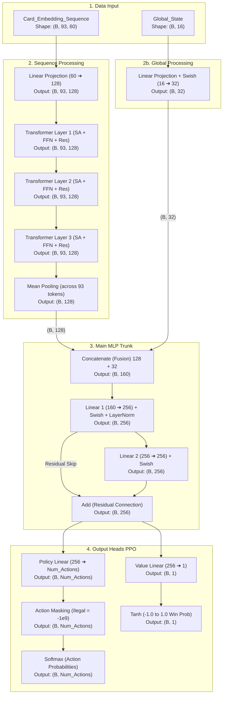

# Brainstorming Input Model Pokemon TCG RL

saya mengibaratkan ini adalah seq_len

my_hand = 20
my_discard = 30
opp_discard = 30

maka di temukan panjang seq awal adalah 80 (hand & discard).
kemudian ditambah 6 slot my_board (1 active + 5 bench) dan 6 slot opp_board (1 active + 5 bench).
kemudian ditambah 1 slot khusus untuk kartu Stadium (stadium_id).
sehingga total seq_len = 80 + 12 + 1 = 93.

Untuk Dimensi setiap kartu:
- Base Embedding ID (card_id) = 32
- *tool_id* dan *pre_evolution_id* akan di-embed (masing-masing dim 32) lalu DIJUMLAHKAN (Add/Sum) dengan base embedding (card_id).
  * Penjelasan Teknis: Daripada memanjangkan ukuran array dengan 'Concat' (menggabungkan yang bikin dimensi bengkak), kita menggunakan trik 'Additive'. Neural Network sangat pintar memisahkan makna dari matriks yang ditambahkan secara berlapis (seperti Positional Encoding pada Transformer).
  * *tool_id*: Sangat krusial agar AI menyadari efek item yang sedang dikenakan Pokemon di arena (misalnya item penambah HP atau penambah Damage seperti Choice Band).
  * *pre_evolution_id*: Sangat krusial agar AI memiliki "ingatan" tentang wujud asli Pokemon tersebut sebelum berevolusi. Ini penting sebagai antisipasi perhitungan AI terhadap kartu/efek musuh yang bersifat *Devolve* (menurunkan tingkat evolusi).
- Skalar Energi = 12
- Stats Fisik (is_present, hp_fraction, damage_counters, appear_this_turn) = 4
- Status Kondisi (poisoned, burned, asleep, paralyzed, confused) = 5
- Action Readiness (attack_1_ready, attack_2_ready, ability_1_ready, ability_2_ready, can_retreat) = 5
- Type Matchup (is_hitting_weakness, is_hitting_resistance) = 2

Total Dimensi Skalar = 12 + 4 + 5 + 5 + 2 = 28.
Maka Total Dimensi = 32 (Embedding) + 28 (Skalar) = 60.

artinya dalam merepresentasikan cards nantinya akan berbentuk (dimensi, seq_len) -> (60, 93).
saya namai ini menjadi *Card_Embedding_Sequence*. (Catatan: Untuk kartu di hand/discard, nilai skalar arena diisi 0.0)

setelah itu kita membaca data state global ini:

| Indeks | Fitur | Penjelasan / Normalisasi |
| :--- | :--- | :--- |
| `0` | `turn_normalized` | Giliran saat ini `(dibagi 100.0)` |
| `1` | `action_count` | Jumlah aksi dalam satu turn `(dibagi 50.0)` |
| `2` | `is_first_player` | `1.0` jika kita pemain pertama |
| `3` | `supporter_played` | `1.0` jika jatah Supporter sudah dipakai |
| `4` | `energy_attached` | `1.0` jika jatah pasang energi manual sudah dipakai |
| `5` | `retreat_used` | `1.0` jika jatah mundur (retreat) manual sudah dipakai giliran ini |
| `6` | `my_board_fraction` | Jumlah Pokemon kita di arena (Active + Bench) `(dibagi 6.0)` |
| `7` | `opp_board_fraction` | Jumlah Pokemon lawan di arena (Active + Bench) `(dibagi 6.0)` |
| `8` | `my_deck_fraction` | Sisa kartu di deck kita `(deckCount / 60.0)` |
| `9` | `opp_deck_fraction` | Sisa kartu di deck lawan `(deckCount / 60.0)` |
| `10` | `my_prize_fraction`| Sisa prize kita `(prizeCount / 6.0)` |
| `11` | `opp_prize_fraction`| Sisa prize lawan `(prizeCount / 6.0)` |
| `12` | `my_vstar_used` | `1.0` jika kekuatan VSTAR/GX kita sudah dipakai di game ini |
| `13` | `opp_vstar_used` | `1.0` jika kekuatan VSTAR/GX lawan sudah dipakai di game ini |
| `14` | `my_lost_zone_fraction`| Jumlah kartu di Lost Zone kita `(lostCount / 10.0)` |
| `15` | `opp_lost_zone_fraction`| Jumlah kartu di Lost Zone lawan `(lostCount / 10.0)` |

Catatan Tambahan:
- `stadium_id` disarankan dikeluarkan dari Global State dan dimasukkan sebagai "slot ke-93" di dalam `Card_Embedding_Sequence` agar arsitektur jauh lebih elegan (dimensi skalar Global menjadi murni angka saja).
- `my_board_fraction` sangat krusial agar AI sadar akan ancaman "Bench Out" (misalnya nilainya 1/6 atau 0.16, AI tahu jika mati 1 maka game over).

---

## Arsitektur Neural Network (JAX/Flax)

Berikut adalah detail spesifikasi dan dimensi layer (berdasarkan standar model RL modern yang cepat dan efisien):

