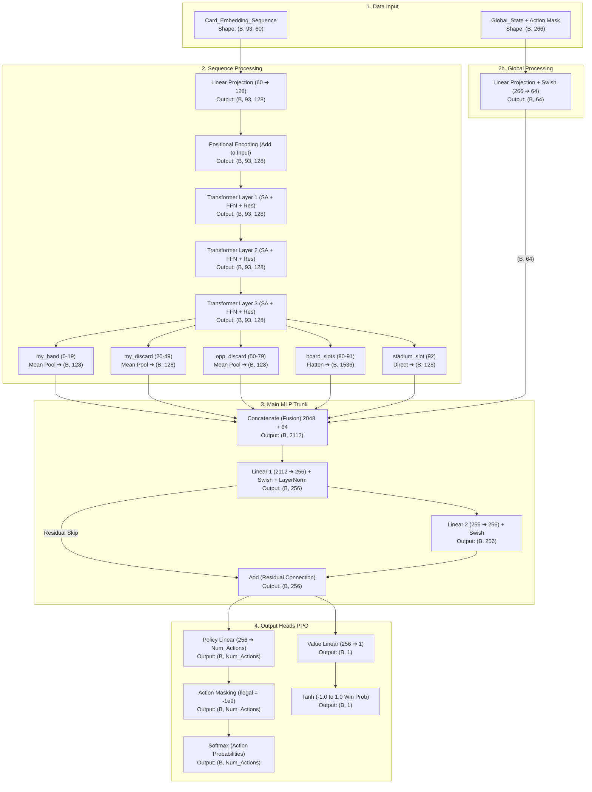

# Brainstorming Input Model Pokemon TCG RL

saya mengibaratkan ini adalah seq_len

my_hand = 20
my_discard = 30
opp_discard = 30

maka di temukan panjang seq awal adalah 80 (hand & discard).
kemudian ditambah 6 slot my_board (1 active + 5 bench) dan 6 slot opp_board (1 active + 5 bench).
kemudian ditambah 1 slot khusus untuk kartu Stadium (stadium_id).
sehingga total seq_len = 80 + 12 + 1 = 93.

Untuk Dimensi setiap kartu:
- Base Embedding ID (card_id) = 32
- *tool_id* dan *pre_evolution_id* akan di-embed (masing-masing dim 32) lalu DIJUMLAHKAN (Add/Sum) dengan base embedding (card_id).
  * Penjelasan Teknis: Daripada memanjangkan ukuran array dengan 'Concat' (menggabungkan yang bikin dimensi bengkak), kita menggunakan trik 'Additive'. Neural Network sangat pintar memisahkan makna dari matriks yang ditambahkan secara berlapis (seperti Positional Encoding pada Transformer).
  * *tool_id*: Sangat krusial agar AI menyadari efek item yang sedang dikenakan Pokemon di arena (misalnya item penambah HP atau penambah Damage seperti Choice Band).
  * *pre_evolution_id*: Sangat krusial agar AI memiliki "ingatan" tentang wujud asli Pokemon tersebut sebelum berevolusi. Ini penting sebagai antisipasi perhitungan AI terhadap kartu/efek musuh yang bersifat *Devolve* (menurunkan tingkat evolusi).
- Skalar Energi = 12
- Stats Fisik (is_present, hp_fraction, damage_counters, appear_this_turn) = 4
- Status Kondisi (poisoned, burned, asleep, paralyzed, confused) = 5
- Action Readiness (attack_1_ready, attack_2_ready, ability_1_ready, ability_2_ready, can_retreat) = 5
- Type Matchup (is_hitting_weakness, is_hitting_resistance) = 2

Total Dimensi Skalar = 12 + 4 + 5 + 5 + 2 = 28.
Maka Total Dimensi = 32 (Embedding) + 28 (Skalar) = 60.

artinya dalam merepresentasikan cards nantinya akan berbentuk (dimensi, seq_len) -> (60, 93).
saya namai ini menjadi *Card_Embedding_Sequence*. (Catatan: Untuk kartu di hand/discard, nilai skalar arena diisi 0.0)

setelah itu kita membaca data state global ini:

| Indeks | Fitur | Penjelasan / Normalisasi |
| :--- | :--- | :--- |
| `0` | `turn_normalized` | Giliran saat ini `(dibagi 100.0)` |
| `1` | `action_count` | Jumlah aksi dalam satu turn `(dibagi 50.0)` |
| `2` | `is_first_player` | `1.0` jika kita pemain pertama |
| `3` | `supporter_played` | `1.0` jika jatah Supporter sudah dipakai |
| `4` | `energy_attached` | `1.0` jika jatah pasang energi manual sudah dipakai |
| `5` | `retreat_used` | `1.0` jika jatah mundur (retreat) manual sudah dipakai giliran ini |
| `6` | `my_board_fraction` | Jumlah Pokemon kita di arena (Active + Bench) `(dibagi 6.0)` |
| `7` | `opp_board_fraction` | Jumlah Pokemon lawan di arena (Active + Bench) `(dibagi 6.0)` |
| `8` | `my_deck_fraction` | Sisa kartu di deck kita `(deckCount / 60.0)` |
| `9` | `opp_deck_fraction` | Sisa kartu di deck lawan `(deckCount / 60.0)` |
| `10` | `my_prize_fraction`| Sisa prize kita `(prizeCount / 6.0)` |
| `11` | `opp_prize_fraction`| Sisa prize lawan `(prizeCount / 6.0)` |
| `12` | `my_vstar_used` | `1.0` jika kekuatan VSTAR/GX kita sudah dipakai di game ini |
| `13` | `opp_vstar_used` | `1.0` jika kekuatan VSTAR/GX lawan sudah dipakai di game ini |
| `14` | `my_lost_zone_fraction`| Jumlah kartu di Lost Zone kita `(lostCount / 10.0)` |
| `15` | `opp_lost_zone_fraction`| Jumlah kartu di Lost Zone lawan `(lostCount / 10.0)` |
| `16-265`| `legal_action_mask` | **(Penting)** Boolean array (dimensi 250) penanda aksi mana yang legal saat ini (1.0 = legal, 0.0 = ilegal). Membantu model mengarahkan fokus kalkulasi. |

Catatan Tambahan:
- `stadium_id` disarankan dikeluarkan dari Global State dan dimasukkan sebagai "slot ke-93" di dalam `Card_Embedding_Sequence` agar arsitektur jauh lebih elegan (dimensi skalar Global menjadi murni angka saja).
- `my_board_fraction` sangat krusial agar AI sadar akan ancaman "Bench Out" (misalnya nilainya 1/6 atau 0.16, AI tahu jika mati 1 maka game over).

---

### Solusi SOTA: Slicing dan Flattening Post-Transformer

Untuk mempertahankan arsitektur elegan tanpa kehilangan detail kritis, alih-alih merata-ratakan ke-93 token sekaligus, kita akan membelah (slice) output `(B, 93, 128)` tersebut sesuai zonanya setelah keluar dari Transformer:

**Zona Kartu Bebas (Hand & Discard) -> Boleh di-Pool**
- **my_hand (Token 0-19)**: Lakukan Mean Pooling ➔ Output: `(B, 128)`
- **my_discard (Token 20-49)**: Lakukan Mean Pooling ➔ Output: `(B, 128)`
- **opp_discard (Token 50-79)**: Lakukan Mean Pooling ➔ Output: `(B, 128)`
> *Alasan: Urutan kartu di tangan atau tumpukan sampah tidak penting (bersifat permutation invariant), jadi merata-ratakannya adalah langkah kompresi yang aman.*

**Zona Arena (Board) -> WAJIB di-Flatten**
- **board_slots (Token 80-91)**: Jangan dirata-ratakan! Lakukan Flatten untuk mempertahankan posisi spesifik setiap slot (Active vs Bench).
> *Kalkulasi: 12 slot * 128 dimensi ➔ Output: `(B, 1536)`*
> *Alasan: Ancaman taktis dari Pokemon di slot Active sangat berbeda nilainya dengan Pokemon di slot Bench. AI harus melihat seluruh papan secara simultan.*

**Zona Spesial (Stadium) -> Ambil Langsung**
- **stadium_slot (Token 92)**: Ekstrak langsung token ini ➔ Output: `(B, 128)`

### Arsitektur Fusion yang Baru

Dengan teknik Slicing di atas, tahap Fusion akan lebih stabil dan bertenaga:
- **Penggabungan Visual Taktis**: 128 (Hand) + 128 (My Discard) + 128 (Opp Discard) + 1536 (Board) + 128 (Stadium) = Vektor berukuran 2048.
- **Penggabungan Final**: Gabungkan vektor 2048 tersebut dengan `Global_State` (berukuran 64 setelah proyeksi). Total input untuk Main MLP menjadi 2112.

---

## Arsitektur Neural Network (JAX/Flax)

**Penting: Positional Encoding**
Karena arsitektur ini menggunakan Transformer (yang secara default bersifat *permutation invariant* atau buta terhadap urutan), kita wajib menambahkan **Positional Encoding** (sebaiknya *Learnable Positional Embeddings* berukuran `(93, 128)`) setelah tahapan *Linear Projection*. Tanpa Positional Encoding, AI tidak akan bisa membedakan slot mana yang merupakan slot Active dan mana yang merupakan slot Bench!

Berikut adalah detail spesifikasi dan dimensi layer (berdasarkan standar model RL modern yang cepat dan efisien):

