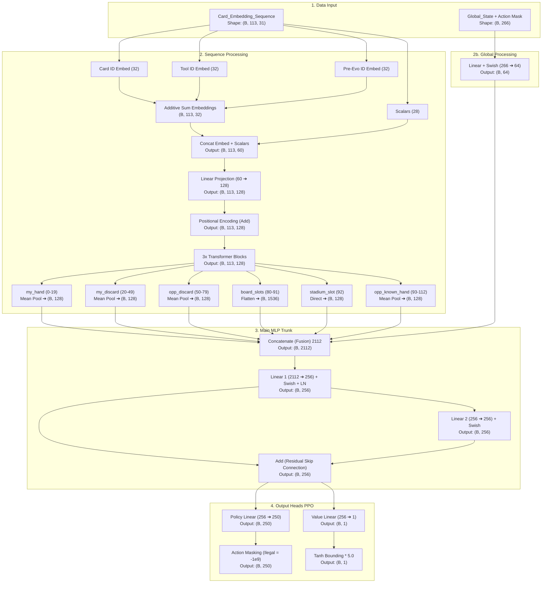

# Analisis Mendalam & Estimasi Konvergensi AI Pokemon TCG

Proyek ini adalah sistem pelatihan agen kecerdasan buatan berbasis **Deep Reinforcement Learning (PPO)** yang diimplementasikan menggunakan **JAX/Flax** dan diakselerasi compiler **XLA** di sisi GPU/CPU, yang berinteraksi dengan Pokémon TCG Simulator Engine stateful dalam bahasa C++ (`libcg.so`) di sisi CPU.

Sistem ini didesain menggunakan **Atomic Design** dan memadukan model pembelajaran penguatan dengan optimalisasi dek melalui algoritma genetika (GA). Berikut adalah analisis mendalam mengenai arsitektur, reward, performa, dan estimasi konvergensi model.

---

## 1. Arsitektur Neural Network (JAX/Flax)

Model menggunakan representasi state sequence-based untuk memanfaatkan keterkaitan antar kartu melalui arsitektur **Transformer (Self-Attention)**.

### Keunggulan Desain Model:
* **Additive Embeddings**: Menggabungkan `card_id`, `tool_id`, dan `pre_evolution_id` dengan metode penjumlahan (bukan concatenation) untuk menghemat memori tanpa menghilangkan representasi taktis (seperti Pokemon Tool atau evolusi sebelumnya).
* **Positional Encoding & Sequence Slicing**: Membantu Transformer membedakan fungsi spasial dari slot kartu (misal: memisahkan arti Pokemon di Active Spot vs Bench, dan melakukan *Mean Pooling* untuk set kartu yang tidak tergantung urutan seperti tangan/discard).
* **Action Masking**: Menyuntikkan masker legal action ke dalam logits PPO dengan nilai $-10^9$ untuk opsi ilegal. Ini membatasi policy space secara masif, mempercepat pembelajaran karena model tidak membuang waktu mengeksplorasi aksi terlarang.
* **Value Tanh Bounding**: Membatasi estimasi value ke rentang $[-5, +5]$ dengan Tanh. Langkah ini menstabilkan perhitungan GAE (*Generalized Advantage Estimation*) dari lonjakan tebakan ekstrem yang sering merusak gradien (*gradient explosion*).

---

## 2. Analisis Sistem Reward (Anti-Reward Hacking)

Sistem reward didesain untuk menyeimbangkan motivasi jangka pendek (*dense breadcrumbs*) dan kemenangan jangka panjang (*sparse win condition*), serta mencegah *reward hacking* (misalnya looping retreat tanpa henti).

### Komponen Reward:
1. **Time Penalty (Stalling Prevention)**: Memberikan penalti langkah linier yang sangat kecil seiring durasi turn `r_step = -0.002 * turn`. Ini mencegah looping tak berujung tanpa meracuni reward kemenangan saat game berdurasi panjang.
2. **Intermediate Rewards (Breadcrumbs)**: 
   * Pemasangan energi (`energy_attached`), pengisian Bench (`bench_built`), dan evolusi (`evolved`) didesain memiliki **Diminishing Returns (Decay)**. Setiap jenis aksi yang berulang dalam satu game akan mendapatkan reward setengah kali lipat dari sebelumnya (`0.50 ** n`). Ini menghilangkan celah eksploitasi looping (seperti bolak-balik me-retreat atau heal-stalling).
   * **Net Damage (Symmetric)**: Reward berbasis selisih damage diberikan secara seimbang `damage_dealt - damage_received`, dibatasi maksimal $+1.0$ per langkah.
3. **Strategic Scaling**: Semua reward intermediate dikalikan dengan faktor penyusutan `intermediate_scale * turn_scale` yang mengecil di akhir permainan (saat sisa *Prize Card* sedikit atau turn bertambah). AI dipaksa mematikan strategi sampingan dan fokus murni pada kondisi terminal (kemenangan).
4. **Unified Terminal Wins/Losses**: Semua kemenangan (Prize, Deck-out, NoActive, Effect) secara konsisten bernilai `+2.0` bagi pemenang dan `-2.0` bagi pecundang. Ini memastikan sinyal kemenangan selalu bernilai tinggi dan mencegah bias aneh di akhir game.

---

## 3. Estimasi Langkah Konvergensi (Convergence Steps)

Untuk mencapai performa convergent (AI mencapai titik keseimbangan optimal dengan strategi stabil), proses training dibagi ke dalam tiga fase utama. Estimasi ini didasarkan pada kompleksitas Pokémon TCG (ruang pencarian aksi legal terbatasi top-masking rata-rata < 15 opsi) dan peningkatan FPS sistem.

### Ringkasan Parameter Latihan per Iterasi:
* **Batch Size**: 64 (atau terukur sesuai VRAM)
* **Rollout Horizon (N_Steps)**: 128
* **Parallel Environments**: 8 (atau kelipatan GPU)
* **Total Steps per Iterasi**: 15.000.000 ($15$ Juta)
* **Kecepatan IPC (Shared Memory)**: $\approx 550\text{ FPS}$

### Pembagian Fase Konvergensi:

| Fase | Target Pembelajaran | Estimasi Steps (Cumulative) | Waktu Komputasi (pada 550 FPS) | Perilaku & Metrik Kunci |
| :--- | :--- | :--- | :--- | :--- |
| **Fase 1: Dasar Aturan** | AI belajar memasang energi, memanggil Pokémon basic, berevolusi, dan menyerang seadanya vs Bot Acak. | **2.000.000 – 5.000.000** | ~1 hingga 2,5 Jam | *Win rate* naik tajam dari 50% menjadi >90% melawan bot acak. Nilai Loss turun drastis. |
| **Fase 2: Liga Self-Play** | Memulai pertempuran melawan diri sendiri (*Frozen Past Agent P1*). AI belajar taktik bench-management, retreat taktis, dan pemilihan serangan optimal. | **10.000.000 – 15.000.000** | ~5 hingga 7,5 Jam | Terjadi siklus pembaruan P1 (setiap P0 win-rate mencapai $\ge 60\%$ dalam 200 game terakhir). |
| **Fase 3: Kematangan Strategi** | AI mempelajari konsep tempo permainan, manajemen prize card, dan adaptasi deck. GA mengoptimalkan komposisi deck berdasarkan evaluasi model. | **20.000.000 – 30.000.000** | ~10 hingga 15 Jam | Model tangguh terhadap deck variasi meta (70%) maupun non-meta/acak (30%). |
| **Konvergensi Penuh** | Kebijakan (*Policy*) stabil, nilai *Entropy* mengecil mendekati target batas eksploitasi ($0.005$). | **35.000.000 – 45.000.000** | ~17,5 hingga 22,7 Jam | Win-rate P0 vs P1 stabil di kisaran 50% (karena kekuatan seimbang), Value Loss mendekati asimtot minimum. |

> [!NOTE]
> Dengan konfigurasi total training di `pipeline.py` yang defaultnya diset ke **15M steps per iterasi** (dengan 3 iterasi, total **45M steps**), parameter pipeline ini sudah tergolong **Convergence-Grade**. AI diproyeksikan akan mengalami konvergensi penuh dan mencapai kemampuan bermain tingkat tinggi di akhir siklus pipeline (total waktu berjalan sekitar 22-23 jam pada GPU lokal dengan FPS 550).

---

## 4. Analisis Hambatan Pelatihan & Solusi Terintegrasi

Sistem pelatihan dilengkapi dengan pengaman canggih untuk mengatasi masalah komputasi RL:

* **Rollback untuk Gradient NaN/Inf**: Di dalam `train.py`, jika *loss* yang dihasilkan JAX bernilai tidak hingga (`NaN/Inf`), model secara otomatis melakukan *rollback* memulihkan bobot dan status optimizer dari salinan langkah sebelumnya.
* **Shared Memory IPC**: Penggunaan `multiprocessing.shared_memory` menghindari overhead serialisasi/pickling data biner antar-proses worker CPU (C++) dan GPU Learner (JAX), sehingga mampu meningkatkan throughput hingga **550 FPS**.
* **PCIe Overhead Guard**: Model AI TCG ini tergolong berukuran medium-kecil (< 5M parameter). Menggunakan multi-GPU via `jax.pmap` dengan bandwidth komunikasi PCIe lambat justru memperlambat FPS karena overhead sinkronisasi gradien lebih besar dibanding komputasi forward-pass. Menjalankan latihan pada **1 GPU tunggal** (misal dengan membatasi via `CUDA_VISIBLE_DEVICES=0`) adalah pilihan paling efisien untuk infrastruktur saat ini.
