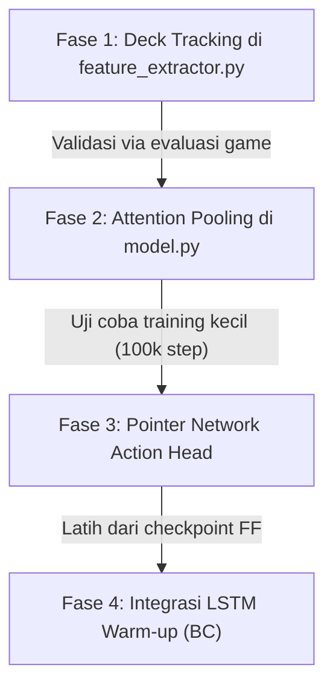

# Rencana Pengembangan Lanjutan: RL Agent TCG (JAX/Flax)

Dokumen ini berisi cetak biru (blueprint) mendetail untuk meningkatkan performa agent RL berbasis LSTM pada game kartu Pokémon TCG. Rencana ini dirancang secara sistematis dengan potongan kode (code snippets) berbasis **JAX/Flax** agar mudah diimplementasikan nantinya tanpa kebingungan.

---

## 1. Deck Tracking di Setiap Step (State Representation)

### Masalah & Latar Belakang
Saat ini, di [feature_extractor.py:L200](file:///root/new_tcg/agent_rl/feature_extractor.py#L200), slot `seq_input[113:172]` (untuk Dek Kita) hanya diisi saat proses pencarian deck berlangsung (`select_data.deck is not None`). Selama turn biasa, slot ini bernilai nol. Hal ini menyulitkan agen untuk membuat keputusan jangka panjang (seperti menghitung sisa energi di dek sebelum menyerang atau menarik kartu).

### Desain Solusi
Kita akan mengubah ekstraktor fitur agar **selalu mengisi** sisa kartu di dalam dek pada setiap step. Jika sedang melakukan pencarian kartu, kita gunakan deck tersaring dari engine, jika tidak, kita gunakan daftar kartu di dek saat ini.

### Rencana Perubahan Kode
Ubah bagian pengisian dek di file `agent_rl/feature_extractor.py` (dan `agent_rl_lstm/feature_extractor.py`):

```python
# Sebelum:
# if select_data is not None and select_data.deck is not None:
#     fill_sequence(seq_input, 113, 60, select_data.deck)

# Sesudah (Hybrid Deck Tracking):
if select_data is not None and select_data.deck is not None:
    # Gunakan filter deck khusus dari engine saat search
    fill_sequence(seq_input, 113, 60, select_data.deck)
else:
    # Selalu isi dengan sisa kartu dek saat ini selama turn biasa
    fill_sequence(seq_input, 113, 60, my_state.deck)
```

> [!TIP]
> Karena model melakukan `mean` terhadap slot dek di [model.py](file:///root/new_tcg/agent_rl_lstm/model.py#L109), urutan dek yang asli tetap tersembunyi (memenuhi aturan *imperfect information*), tetapi agen sekarang memiliki pengetahuan tentang *bag-of-cards* isi sisa deknya.

---

## 2. Multi-Head Attention Pooling (Model Architecture)

### Masalah & Latar Belakang
Saat ini, model menggunakan rata-rata sederhana (`jnp.mean`) untuk merangkum fitur kartu di Hand, Discard, dan Deck menjadi satu vektor berukuran 128. Rata-rata meredam sinyal dari kartu-kartu penting (misal, 1 kartu Supporter krusial di tangan kontribusinya menyusut menjadi hanya 10% jika ada 10 kartu di tangan).

### Desain Solusi
Ganti `jnp.mean` dengan **Multi-Head Attention Pooling (MAP)**. Kita definisikan sebuah token *Query* belajar khusus. Query ini akan meng-attend seluruh kartu di Hand/Discard/Deck untuk memusatkan perhatian pada kartu yang paling bernilai bagi taktik giliran tersebut.

### JAX/Flax Implementation Template
Tambahkan modul baru di `agent_rl_lstm/model.py`:

```python
class AttentionPooling(nn.Module):
    embed_dim: int
    num_heads: int = 4

    @nn.compact
    def __call__(self, x, mask=None):
        # x shape: (B, seq_len, embed_dim)
        # mask shape: (B, seq_len) - True untuk kartu yang ada, False untuk padding kosong
        
        # 1. Definisikan token Query belajar khusus
        query = self.param(
            'pool_query', 
            nn.initializers.normal(stddev=0.02), 
            (1, 1, self.embed_dim)
        )
        # Duplikat query sebanyak batch size
        query = jnp.tile(query, (x.shape[0], 1, 1)) # Shape: (B, 1, embed_dim)
        
        # 2. Siapkan mask untuk attention
        attn_mask = None
        if mask is not None:
            # MultiHeadDotProductAttention memerlukan mask dengan shape (B, num_heads, query_len, key_len)
            attn_mask = mask[:, jnp.newaxis, jnp.newaxis, :] # Shape: (B, 1, 1, seq_len)
        
        # 3. Hitung Cross-Attention (Query meng-attend x)
        attn_out = nn.MultiHeadDotProductAttention(
            num_heads=self.num_heads,
            qkv_features=self.embed_dim,
            out_features=self.embed_dim
        )(query, x, mask=attn_mask) # Shape: (B, 1, embed_dim)
        
        return jnp.squeeze(attn_out, axis=1) # Shape: (B, embed_dim)
```

Di dalam kelas `PokemonAgent`, ganti pemanggilan `jnp.mean` dengan modul ini:

```python
# Inisialisasi pooler di __call__ atau setup
hand_pooler = AttentionPooling(embed_dim=self.embed_dim)
my_hand_mask = seq_input[:, 0:20, 15] > 0.5 # features[15] adalah is_present
my_hand = hand_pooler(x[:, 0:20, :], mask=my_hand_mask)
```

---

## 3. Context-Aware Pointer Network (Action Space)

### Masalah & Latar Belakang
Pemetaan aksi absolut saat ini (indeks 0-249) mematikan hubungan semantik antara fitur kartu yang diinputkan dengan aksi yang dipilih. Model harus belajar secara trial-and-error bahwa "Aksi 0" terikat pada "indeks tangan 0". Jika letak kartu bergeser, model bingung.

### Desain Solusi
Kita ubah Action Head menjadi **Pointer Network**. Model akan memproyeksikan state internalnya menjadi vektor Query $Q$ berukuran 128. Di saat yang sama, kita buat matriks Key $K$ berukuran $(B, 250, 128)$ di mana baris ke-$i$ adalah representasi embedding dari objek opsi ke-$i$. Skor probabilitas opsi ke-$i$ dihitung lewat dot-product: $Score_i = Q \cdot K_i$.

### Penanganan Kasus Khusus (Tanya-Jawab)

#### A. Opsi Serangan (1 Pokémon dengan 2 Serangan)
Pokémon aktif memiliki representasi kartu $E_{poke}$ dari Transformer. Serangan itu sendiri memiliki properti (Damage, Energy Cost). Kita buat MLP kecil untuk serangan tersebut sehingga menghasilkan $E_{atk1}$ dan $E_{atk2}$.
* **Opsi Serangan 1**: $Key = E_{poke} + E_{atk1}$
* **Opsi Serangan 2**: $Key = E_{poke} + E_{atk2}$
Karena $E_{atk1} \neq E_{atk2}$, model bisa membedakan kedua serangan tersebut secara presisi lewat dot-product dengan Query taktiknya.

#### B. Kartu Duplikat di Dek (2-3 Ultra Ball)
Memilih Ultra Ball ke-1 atau ke-2 di dek memberikan hasil game yang sama.
* **Pendekatan Alami**: Kedua opsi akan mendapat representasi embedding yang sama, sehingga nilai dot-product-nya identik. Peluang sampling akan terbagi rata (misal masing-masing 45%). Hal ini justru aman dan membantu eksplorasi model.
* **Pendekatan Positional**: Jika ingin membedakan secara tegas, tambahkan bias posisi:
  $$Key_i = E_{card} + EmbeddingPosisi(i)$$

#### C. Pemilihan Multipel Autoregressif (Memilih $N$ Kartu)
Alih-alih langsung mengambil $N$ kartu teratas dari probabilitas sekali-jalan (*non-autoregressive*), kita bisa memperbarui state query menggunakan LSTM secara bertahap:
1. Hitung query $Q_1$, dot-product dengan semua opsi, lalu sampel opsi pertama $idx_1$.
2. Ambil embedding dari opsi terpilih $Key_{idx_1}$, masukkan kembali ke LSTM cell sebagai input tambahan untuk menghasilkan query baru $Q_2$.
3. Masking opsi $idx_1$ agar tidak bisa dipilih lagi ($-\infty$ pada logit).
4. Hitung dot-product $Q_2 \cdot Key_i$ untuk opsi yang tersisa, lalu sampel opsi kedua $idx_2$.

### JAX/Flax Implementation Snippet
Berikut rancangan Action Head berbasis Pointer Network di `model.py`:

```python
class PointerActionHead(nn.Module):
    num_actions: int = 250
    embed_dim: int = 128

    @nn.compact
    def __call__(self, state_representation, option_embeddings, action_mask):
        # state_representation: (B, embed_dim) -> Output dari LSTM
        # option_embeddings: (B, 250, embed_dim) -> Vektor representasi tiap opsi legal
        # action_mask: (B, 250) -> 1.0 jika legal, 0.0 jika ilegal

        # 1. Proyeksikan state menjadi Query
        query = nn.Dense(self.embed_dim)(state_representation) # Shape: (B, embed_dim)
        query = query[:, jnp.newaxis, :] # Shape: (B, 1, embed_dim)

        # 2. Hitung dot product antara Query dan Key Opsi
        # option_embeddings acts as Keys
        logits = jnp.sum(query * option_embeddings, axis=-1) # Shape: (B, 250)
        logits = jnp.clip(logits, -10.0, 10.0)

        # 3. Masking opsi ilegal
        masked_logits = logits - 1e9 * (1.0 - action_mask)
        return masked_logits
```

---

## 4. LSTM Warm-up via Behavioral Cloning (RL Training Pipeline)

### Masalah & Latar Belakang
Saat melakukan transisi dari model FF ke LSTM, seluruh parameter transformer disalin sedangkan LSTM Cell diinisialisasi secara acak. LSTM Cell yang acak di tengah-tengah network yang beku (*frozen*) akan merusak penyelarasan output head (Dense_4 dan Dense_5) yang sebenarnya sudah terlatih. Ini menyebabkan degradasi performa tajam saat mulai melatih RL.

### Desain Solusi
Sebelum memulai PPO RL secara penuh, lakukan fase **Behavioral Cloning (BC)** singkat selama ~5.000 step:
* Jalankan simulasi game menggunakan aksi dari model FF asli sebagai *target*.
* Bekukan seluruh layer kecuali LSTM Cell.
* Latih LSTM Cell agar outputnya meniru keputusan model FF (minimalkan *Cross-Entropy Loss* antara logits LSTM dan logits FF).
* Setelah loss mendekati nol (LSTM telah belajar memetakan input secara transparan tanpa mengubah keputusan), matikan BC dan jalankan PPO RL penuh.

---

## Rencana Implementasi Bertahap

Untuk mempermudah eksekusi nanti, lakukan implementasi dengan urutan berikut:


